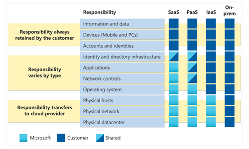

# Introduction
In this module, you’ll be introduced to cloud service types. You’ll learn how each cloud service type determines the flexibility you’ll have with managing and configuring resources. You'll understand how the shared responsibility model applies to each cloud service type, and about various use cases for each cloud service type.

## Learning objectives
After completing this module, you’ll be able to:
    * Describe infrastructure as a service (IaaS).
    * Describe platform as a service (PaaS).
    * Describe software as a service (SaaS).
    * Identify appropriate use cases for each cloud service (IaaS, PaaS, SaaS).

| **Category**        | **IaaS (Infrastructure as a Service)**                          | **PaaS (Platform as a Service)**                             | **SaaS (Software as a Service)**                                |
|---------------------|-----------------------------------------------------------------|--------------------------------------------------------------|----------------------------------------------------------------|
| **Definition**       | Provides virtualized computing resources over the internet.     | Provides a platform allowing developers to build applications without managing infrastructure. | Provides software applications over the internet, accessible via a web browser. |
| **Target Users**     | IT administrators, system architects, developers.              | Developers, software engineers.                              | End-users, businesses, and individuals who need ready-to-use software. |
| **Key Offerings**    | Virtual machines, storage, networks, and other computing resources. | Development tools, databases, middleware, and operating systems. | Business apps (CRM, ERP), email, collaboration tools, productivity apps (Google Workspace, Microsoft 365). |
| **Management Level** | Users manage applications, data, runtime, middleware, OS.      | Users manage applications and data, but not the OS or hardware. | Vendor manages everything; users access the software.              |
| **Customization**    | Highly customizable (control over infrastructure).             | Some customization possible at the application level.         | Limited to no customization beyond user-specific settings.        |
| **Examples**         | AWS EC2, Microsoft Azure VMs, Google Compute Engine.           | Google App Engine, AWS Elastic Beanstalk, Microsoft Azure App Service. | Google Workspace, Salesforce, Dropbox, Microsoft 365.              |
| **Scalability**      | Highly scalable, users can control and manage resources flexibly. | Scalable depending on platform capabilities.                  | Automatically scalable by the provider.                           |
| **Cost Model**       | Pay-as-you-go for resources used (VMs, storage, etc.).          | Pay for platform services, often usage-based.                 | Subscription-based pricing, typically per user or organization.   |
| **Maintenance**      | Users are responsible for maintenance of applications, security patches, etc. | Vendor manages infrastructure, but users manage apps and data. | Vendor handles all maintenance, including updates and security.   |
| **Security**         | Users must secure their applications and data.                 | Vendor secures the platform, but users handle app and data security. | Vendor is responsible for securing the software and data.         |

## How do I know which cloud service is most suitable for me?
To determine which cloud service is most suitable for you, consider the following factors based on your needs:

### 1. **Level of Control and Customization**
   - **IaaS (Infrastructure as a Service)**: If you need full control over the infrastructure (virtual machines, storage, networks) and want to configure and manage everything from the operating system upward, IaaS is the best choice. It's ideal for businesses that require flexibility, scalability, and customization at the infrastructure level.
   - **PaaS (Platform as a Service)**: If you want to focus on developing applications without worrying about the underlying infrastructure, PaaS is more suitable. This is for developers who need a ready-to-use platform (including operating systems, middleware, etc.) but don't want to manage the hardware or networking.
   - **SaaS (Software as a Service)**: If you only need access to software (such as email, CRM systems, or productivity tools) without worrying about maintenance or updates, SaaS is the way to go. This is the simplest option for end-users who just want to use an application.

### 2. **Technical Expertise**
   - **IaaS**: Suitable for teams with strong technical expertise. You'll be responsible for managing servers, networks, storage, and the software stack.
   - **PaaS**: Requires some technical expertise, especially for building, deploying, and managing applications, but you won’t need to handle the infrastructure.
   - **SaaS**: Requires minimal to no technical expertise. You simply use the software via a web interface.

### 3. **Development vs. Usage**
   - **IaaS**: Best for organizations that need to build custom environments or want to run complex workloads like big data or machine learning.
   - **PaaS**: Great for developers who want to focus on coding and application development without the need to manage the underlying infrastructure.
   - **SaaS**: Ideal for users who just need access to software to perform tasks without worrying about technical details (like using email, project management tools, etc.).

### 4. **Cost and Scalability**
   - **IaaS**: You only pay for what you use (virtual machines, storage, etc.). It can be cost-effective if you need flexibility and high scalability. However, managing costs can be tricky without proper resource management.
   - **PaaS**: You pay for the platform services and resources you use. It scales with your application's usage but can sometimes be more expensive than IaaS if you're using advanced platform features.
   - **SaaS**: Usually subscription-based (per user, per month). It’s cost-effective for businesses that need software without upfront infrastructure or development costs.

### 5. **Maintenance Responsibility**
   - **IaaS**: You maintain the applications, middleware, and operating systems. The vendor manages only the infrastructure (hardware, storage, networking).
   - **PaaS**: The vendor manages the infrastructure and operating system, while you maintain the applications and data.
   - **SaaS**: The vendor maintains everything—application, data, updates, and security—allowing you to focus solely on using the software.

### 6. **Use Cases**
   - **IaaS**: Suitable for enterprise-grade IT infrastructures, test environments, data centers, or scenarios where you need to control and manage the infrastructure yourself.
   - **PaaS**: Best for app development environments, where developers need to build, test, and deploy software quickly.
   - **SaaS**: Great for business users needing applications like email, CRM, ERP systems, or collaborative tools without needing to worry about how they run or are maintained.

### Decision Flow
- **If you want full control over computing resources and infrastructure**, go for **IaaS**.
- **If you're focused on developing applications and don’t want to handle infrastructure**, choose **PaaS**.
- **If you just need ready-to-use software for everyday business needs**, **SaaS** is the simplest solution.

### Examples of Common Scenarios:
- **Startups or Developers**: If you're a small development team focused on creating and deploying apps quickly, **PaaS** could be ideal since it saves you time and resources on infrastructure management.
- **Large Enterprises**: If you require control over security, compliance, or specific server configurations, **IaaS** might be better suited for you.
- **Small Businesses/End-users**: If you're looking for tools like email, project management, or CRM software, **SaaS** would be the easiest and most cost-effective option.

### Final Thoughts
- **Cost, flexibility, and control** are the main differentiators. If you need more control, **IaaS** is the way to go. If you’re a developer looking to build and deploy applications, **PaaS** is best. If you just need functional, easy-to-use software, **SaaS** is the simplest option.